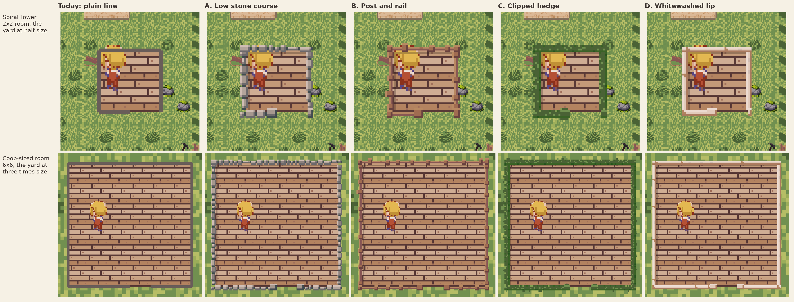

# A thin wall for a room — four candidates and today's line

Daniel asked on 2026-09-29 for "visual styles for creating a barrier separating an
indoor from an outdoor space that doesn't take up a tile (just narrowly around the
perimeter)". These are four, captured in the real game beside the plain grey line
the Spiral Tower's room draws today. **The pick is Daniel's**; the question is on
HQ as decision card Q-135 (`hq/data/decisions/Q-135.json`).

## What is in this folder

| File | What it shows |
|---|---|
| `comparison.png` | All five styles side by side, cropped around the room and enlarged without smoothing (the tower ×3, the coop-sized room ×2). |
| `tower_<style>.png` | The Spiral Tower's room — 2×2 floor squares, with the farm outside drawn at half size — as the game draws it at 800×600. |
| `coop_<style>.png` | A coop-sized room — 6×6 floor squares, the farm outside drawn three times larger — with the same edge. |
| `<room>_frame.json` | Where the room sat on screen, which is what the side-by-side crops by. |

Every capture uses the same seed, the same building in the same spot, the farmer on
the same square and the camera at rest, so the edge is the only thing that differs
between pictures of the same room.

**The coop row is for judging scale, not a proposal for the coop.** The real coop
spends a whole ring of squares on walls, leaving a 4×4 floor. For these pictures
the capture tool floors that ring over and draws the thin edge instead, so each
style can be seen at the finest room scale the game has. Whether the coop or the
farmhouse should ever give up their rings is a separate question: it would change
the space the hen has, which is a change to the game, not to its drawing.

## The candidates

The measurements are in the room's own pixels, the size of one pixel of its
wooden floor. A floor square is 16 of them across.

- **Today — the plain line.** A 2-pixel grey line centred on the room's edge, with
  a gap where the door is. Five lines to draw.
- **A. Low stone course.** A single course of uneven stones in the tower's own
  greys, with mortar between them and a bigger squared stone on each side of the
  door. 4 pixels deep; 135 rectangles for the tower, 418 for the coop-sized room.
- **B. Post and rail.** A wooden rail in the fence's browns, with posts at uneven
  spacing and wider posts either side of the door. 4 pixels deep; 94 and 193
  rectangles.
- **C. Clipped hedge.** A dark hedge in the farm hedge's greens, in uneven clumps
  with lit leaves scattered over them and a rounded end on each side of the door.
  4 pixels deep; 176 and 518 rectangles.
- **D. Whitewashed lip.** A low cream plaster wall in the farmhouse's colours,
  with a few grey stains and flaked patches at uneven places and a squared pillar
  each side of the door. 3 pixels deep; 38 and 60 rectangles.

Each style covers one pixel of the floor's edge (two at the door posts) and puts
the rest on the yard side, plus a one-pixel shadow cast onto the floor under the
north and west walls. No style covers a floor square. Stone lengths, post spacing,
hedge clumps and plaster marks come from a hash of their position, so no stretch
repeats a pattern the eye can predict, and the same room always looks the same.

**What drawing costs.** No style needs new art files; each is drawn in the game's
existing colours. The rectangles are worked out once per room and kept, then drawn
each frame only while the farmer is inside, and only for the room she is in. The
most expensive, the hedge around the larger room, is about 500 flat rectangles.
If a tablet profile ever shows that matters, the chosen style can be drawn once
into a small picture and reused.

## A strawman

**A, the stone course**, for the Spiral Tower. The tower is built of that stone, so
the room's edge reads as the tower's own wall seen from inside. Grey stone also
stands apart from both the green grass outside and the brown floor inside, at both
room sizes, while the hedge sinks into the field's dark tufts and the rail shares
the floor's browns. Daniel may prefer another, or today's line.

## Trying one in the game, and remaking the pictures

The style is chosen in one place, `world/room_edge_style.gd`. Today's line stays
the default until a style is picked. To play with a candidate, start the game with
it named after `--`:

    godot --path . -- --room-edge=stone      # or timber, hedge, plaster, plain

To remake every picture here (needs a display; the farm is a fresh one from a fixed
seed, saved only to scratch files, never to the player's autosave):

    godot --path . res://tools/capture_thin_walls.tscn --room=tower
    godot --path . res://tools/capture_thin_walls.tscn --room=coop
    python3 tools/compose_thin_walls.py
