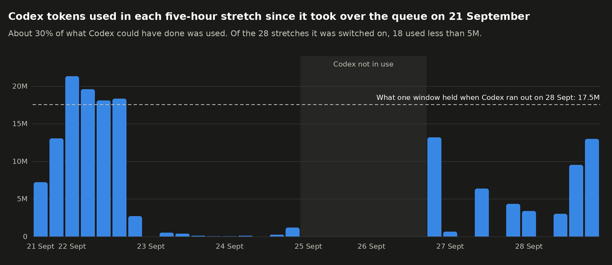

# What Codex works on when the queue runs out (Q-134, proposed 2026-09-29)

**Status: proposal, waiting on Daniel's ruling on Q-134.** Drafted by the chief of
staff. Nothing here is built.

## The problem, measured

Daniel's standing rule (2026-09-26) is that Codex works the queue until its allowance
runs out, every five-hour window: running dry is normal, unused capacity is the
problem. The allowance is not what runs out first. The queue is.

- **What a window holds.** Codex ran out on 28 September at 22:51, after 17.5 million
  tokens in the five hours before (1.8 million of them new rather than re-read). On
  22 September four stretches used 18 to 21 million without running out, so 17.5
  million is a floor, not the ceiling.
- **What was used.** From 21 September 15:00 to 29 September 03:00 Codex used 156
  million tokens. Leaving out the eight stretches of 25–26 September when it was not
  in use, the other 28 used about 30% of 28 × 17.5 million. Only four reached the
  17.5 million line; 18 used less than 5 million.
- **Why.** On 23–24 September the queue was stuck, which the 26–28 September session
  fixed. From 27 September on, with it working, 245 of the drain's 283 runs did
  nothing: 37 found nothing queued, and 208 found only a card they could not start
  and finished in under a minute without a model call.

Source: `history/tokens.jsonl` and `history/limits.jsonl` in HQ's record store, and
`journalctl --user -u tiny-farm-drain.service`. The stretches are clock-aligned from
21 September 15:00, not Codex's own windows, so each bar is an approximation.

## The proposal

When the drain finds nothing it can start and the Codex window still has room, the
chief of staff refills the queue from what the studio already records, in this
order, and stops as soon as the cap below is reached.

| Order | Source | Becomes | Example from this week |
|---|---|---|---|
| 1 | A new tablet play session's automatic summary | A card for the role that owns the finding | "24 squares refused her repeatedly" (28 Sept), filed by hand today |
| 2 | A goal whose check fails or measures nothing | A card for the goal's owner to make the check pass or measurable | The store-page step (Elena), the program report (Sofia), the money record (Harold) |
| 3 | The next unbuilt step of a project in progress | Story-sized cards for that project's owner | Public release; phase-2 design |
| 4 | A regular list of checks for each role, drawn from what the role watches in `org.json` | A check that measures one thing and files a fix when it is off | Grace: both suites and the visual baseline. Jade: dead taps in play traces. Sam: touch-target sizes. Anna: crop and weather test coverage |

Source 4 is the one that never runs out. The chief of staff drafts each role's list
once from its org record and notes, keeps it in `hq/data/staff/<id>/standing.json`,
and refreshes it weekly.

### Guardrails

- **Only work the studio can finish and ship without Daniel.** A refill card is tier 0
  or 1, so S-16 lets the studio merge it once it is verified. Nothing that
  publishes, spends money or settles a question of taste is filed by the refill.
- **One question at a time.** When refill work turns up something only Daniel can
  decide, it waits as a single prepared question (S-17). The refill never has more
  than one open card on his decisions page.
- **A cap.** At most six refill cards are open at once; the refill tops up to six and
  stops.
- **Every refill card names its source** (the play session, the goal check, the
  project step or the line on a role's list) and reports what it spent when it closes.
- **Codex only.** The refill never starts work on the Claude allowance.

### What Daniel sees

One line on the Work page for the week: Codex's use in each window against what a
window holds, and how many refill cards were merged, were dropped, or are still open. If
the line shows refill work being dropped more often than merged, the refill is switched
off with the same pause the drain already has.

### What a yes builds

One card for the chief of staff. The first version is deliberately small:

1. A refill step in `hq/drain.py` that runs when a run finds nothing it can start
   and the Codex window has not run dry.
2. Sources 1, 2 and 4, in that order. Source 3 follows once a week of results shows
   the refill's work being merged, because breaking a project into steps involves more
   judgement than the other three.
3. The six-card cap, the tier guard, the one-question rule and the weekly line.

## The alternatives

- **Role lists only.** Simpler: the queue takes from each role's list in turn. The
  lists are written ahead of time, so they drift away from what players actually
  hit, which sources 1 and 2 track directly.
- **Spare capacity into the phase-4 learning research.** Kenji's experiments on the
  recorded play sessions can use any amount of capacity. Their results are research
  notes nobody acts on until phase 4, so the allowance would be spent but not on the
  game players have now.
- **Leave spare capacity unused.** The queue works only what people file, and about
  two-thirds of the Codex allowance keeps going unused.

## Known risk

More work merging unattended means more cards finishing against a main branch that
has moved. On 28 September two Mark III cards passed both suites every time and still
spent about 17.5 million tokens being rebuilt, because other merges kept changing
the files they change. The drain now rebuilds such a card with a new model session
whenever any of its files changed, even when its patch still merges cleanly; making
a clean merge re-test without a new session is filed separately and should be merged
before the refill is built.
