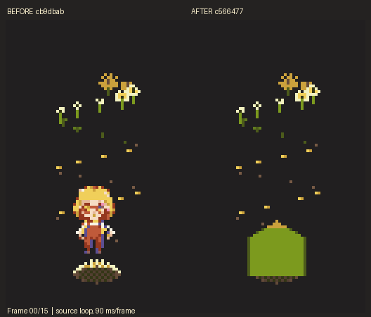
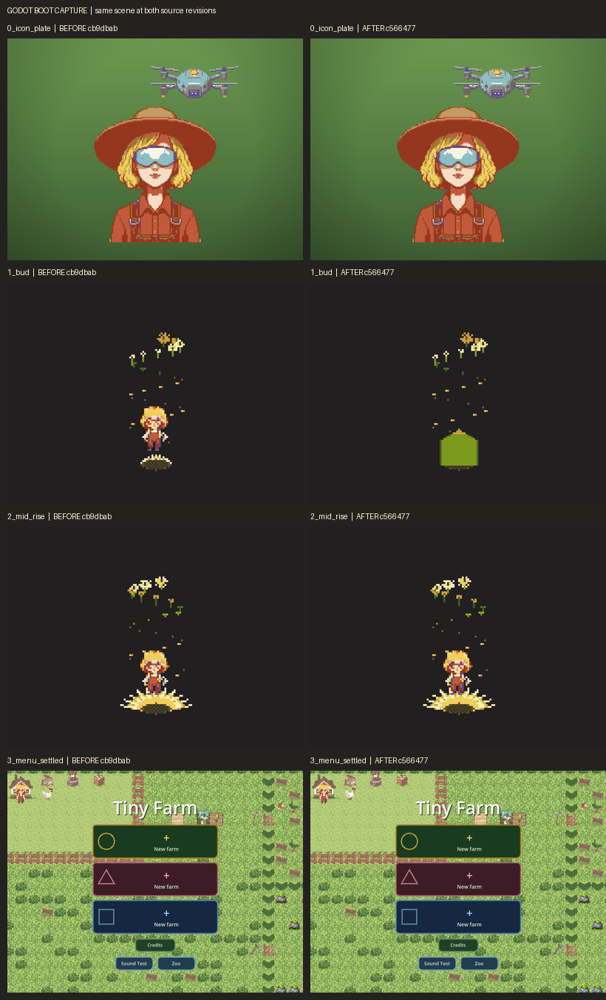
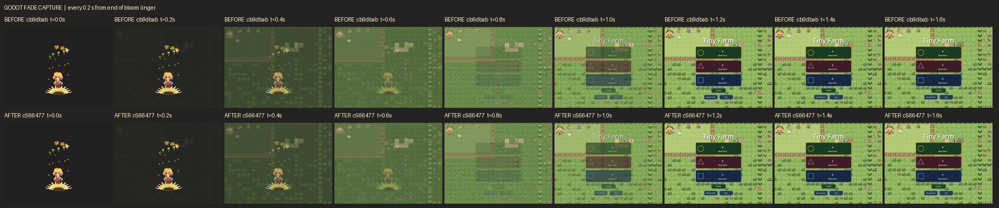

# Boot bloom before and after — w2d226ab695b

The **before** source is `cb9dbab`, the pre-redraw tree named on the card. The **after** source is `c566477`, the commit that saved the previously uncommitted redraw; its sunflower script and sheet are byte-identical to `origin/main` at capture time (`306e4cb`). The later `f66692f` branch is a different, unmerged revision and is not labeled as this card's after.

The animated PNG (also available as [a GIF](before_after_loop.gif)) places the two committed `tools/experiments/out/sunflower_bloom/sunflower_bloom.gif` loops together, preserving all 16 frames at 90 ms per frame. It shows the animation asset, including the later return to frame 0. The Godot captures below show what these same two trees actually rendered in `tools/capture_boot_bloom.tscn` and `tools/capture_boot_fade.tscn`.

The boot capture samples the icon plate, the bloom's first frame, a point 0.7 s into the rise, and the settled menu. The fade capture samples every 0.2 s from the end of the flower linger through 1.6 s. Both scenes ran under Godot 4.7.2 with the OpenGL 3 driver and an isolated `XDG_DATA_HOME` for each source tree. Captures were made from `git archive` copies in `/tmp`, so no working tree or save slot was used. Both Godot scenes exited 0 after writing their frames. The capture tools print shutdown resource warnings after `done`; no scene script error was reported.

The two fade rows use separate temporary save data and may show different generated farm details. Compare the flower and transition timing, not the background's object placement.
